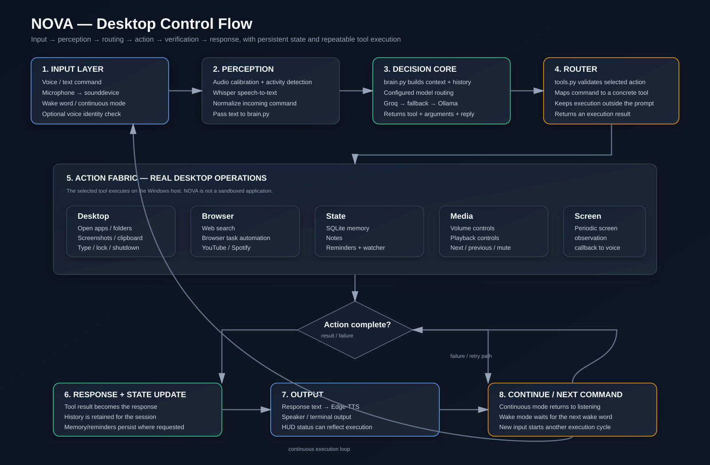

# NOVA

NOVA is a Windows desktop assistant written in Python. It is designed to sit close to the operating system and turn natural voice or text commands into practical desktop actions.

The project combines speech input, speech output, wake-word handling, persistent memory, reminders, browser automation, media controls, screenshots, desktop utilities and a modular tool layer.

NOVA is intended for local use on a Windows machine. Model-backed responses can use a configured cloud provider, with Ollama available as a local fallback.

## Current Capabilities

| Component | Status | Implementation |
| --- | --- | --- |
| Voice input | Available | Whisper + sounddevice |
| Voice output | Available | Microsoft Edge-TTS |
| Wake word | Available | openWakeWord |
| Voice identification | Available | SpeechBrain ECAPA |
| Continuous listening | Available | `main.py --continuous` |
| Desktop control | Available | `tools.py` |
| Browser automation | Available | `browser_agent.py` |
| Memory and notes | Available | SQLite |
| Reminders | Available | `reminders.py` |
| Screen monitoring | Available | `screen_watcher.py` |
| Desktop HUD | Available | `hud.py` |
| Text mode | Available | `main.py --text` |

## What NOVA Does

NOVA is organized around executable tools rather than a chat-only interface.

It can currently:

- open Windows applications, folders and supported websites
- take and open screenshots
- search files
- type text and copy content to the clipboard
- control system volume and media playback
- lock Windows
- schedule or cancel shutdown and restart commands
- search the web
- search and open YouTube content
- open and search Spotify
- perform browser tasks through the browser automation layer
- create, list and clear reminders
- store, recall and remove facts
- create and list notes
- monitor the screen at a configured interval
- respond through voice or text

## System Architecture

NOVA follows a simple control pipeline:

```text
Input
  |
  +--> Voice --------------------+
  |                              |
  +--> Text ---------------------+
                                 v
                         Perception Layer
                                 |
                         Whisper / text input
                                 |
                                 v
                           Decision Core
                              brain.py
                                 |
                    +------------+------------+
                    |                         |
                 tool needed               no tool
                    |                         |
                    v                         v
                tools.py               direct response
                    |
                    v
             Windows / Browser /
             Memory / Media /
             Reminders / Screen
                    |
                    v
              Execution result
                    |
                    v
               Final response
                    |
             +------+------+
             |             |
          Edge-TTS       Terminal
             |
           Speaker
```

## NOVA Execution Workflow

The following diagram represents the runtime control flow used by the project. It is intentionally structured as an execution loop: receive input, interpret it, select an operation, execute the operation, return the result, update state, and continue listening.



### Workflow in text

```text
COMMAND RECEIVED
      |
      v
+-------------------+
| INPUT             |
| Voice / Text      |
+---------+---------+
          |
          v
+-------------------+
| PERCEPTION        |
| Wake / VAD        |
| Voice ID          |
| Whisper STT       |
+---------+---------+
          |
          v
+-------------------+
| DECISION CORE     |
| brain.py          |
| Context + history |
| Model routing     |
+---------+---------+
          |
          v
+-------------------+
| TOOL REQUIRED?    |
+-----+---------+---+
      |         |
     YES        NO
      |         |
      v         v
+-----------+  +----------------+
| tools.py  |  | Direct reply   |
+-----+-----+  +-------+--------+
      |                |
      v                |
+-------------------+  |
| EXECUTE ACTION    |  |
| Desktop           |  |
| Browser           |  |
| Memory            |  |
| Reminders         |  |
| Media             |  |
| Screen            |  |
+---------+---------+  |
          |            |
          +-----+------+
                |
                v
        +---------------+
        | RESULT        |
        | Success/Error |
        +-------+-------+
                |
                v
        +---------------+
        | STATE UPDATE  |
        | History       |
        | Memory        |
        | Reminders     |
        +-------+-------+
                |
                v
        +---------------+
        | OUTPUT        |
        | Edge-TTS      |
        | Terminal      |
        | HUD           |
        +-------+-------+
                |
                v
        +---------------+
        | CONTINUE      |
        | Listen again  |
        +-------+-------+
                |
                +----------------------+
                                       |
                                       v
                                NEXT COMMAND
```

## Decision and Tool Routing

The main decision point lives in `brain.py`.

The model is not responsible for directly controlling Windows. It returns a structured result containing:

- the selected tool
- the arguments for that tool
- the response text

`tools.py` then maps the selected operation to an actual Python function.

This separation keeps the reasoning layer and the operating-system action layer independent.

Current model routing in `brain.py`:

```python
GROQ_MODEL = "openai/gpt-oss-120b"
GROQ_FALLBACK = "openai/gpt-oss-20b"
OLLAMA_MODEL = "llama3.2"
```

The normal route attempts the configured Groq model first. If that path is unavailable, NOVA can fall back to Ollama when it is installed and configured.

## Voice Pipeline

```text
Microphone
    |
    v
sounddevice
    |
    v
Audio calibration / activity detection
    |
    v
Whisper
    |
    v
Transcribed command
    |
    v
brain.py
    |
    v
Tool execution or direct response
    |
    v
Edge-TTS
    |
    v
Speaker
```

The current voice configuration includes:

```python
EDGE_VOICE = "hi-IN-MadhurNeural"
EDGE_RATE = "+5%"
EDGE_PITCH = "+0Hz"
```

The wake-word module currently listens for:

```text
Hey Jarvis
```

Voice registration is handled by `voice_id.py`, which stores the local reference profile as `boss_voice.pkl`.

## Core Modules

| File | Responsibility |
| --- | --- |
| `main.py` | Main entry point for voice, continuous and text modes |
| `brain.py` | Model calls, context handling, response parsing and tool selection |
| `tools.py` | Desktop, browser, media, clipboard, memory and reminder operations |
| `suno.py` | Microphone capture, Whisper transcription and stop-command listening |
| `bolo.py` | Speech output, Edge-TTS playback and interruption handling |
| `wake.py` | Wake-word detection |
| `voice_id.py` | Voice registration and speaker verification |
| `browser_agent.py` | Browser automation |
| `browser_prompt.py` | Browser task prompt construction |
| `memory.py` | Persistent facts and notes using SQLite |
| `reminders.py` | Reminder storage and watcher |
| `screen_watcher.py` | Periodic screen observation |
| `hud.py` | Floating desktop status display |
| `shutdown.py` | Shutdown-related helper logic |
| `requirements.txt` | Python dependencies |
| `.github/workflows/python-check.yml` | GitHub Actions syntax validation |

## Tool Layer

### Desktop

- application and folder opening
- screenshot capture
- file search
- clipboard copy
- text typing
- workstation lock
- shutdown and restart commands

### Browser

- web search
- browser task automation
- browser closing
- YouTube search and playback
- Spotify search

### Media

- volume up, down and mute
- play and pause
- next and previous track

### Productivity

- reminders
- persistent facts
- notes

## Installation

NOVA is primarily intended for Windows 10 and Windows 11.

### Requirements

- Windows 10 or Windows 11
- Python 3.10 or newer
- working microphone
- speakers or headphones
- enough RAM for Whisper inference
- internet access for cloud model calls, Edge-TTS and browser-related features when enabled

Clone the repository:

```bash
git clone https://github.com/Pappu246/nova-assistant.git
cd nova-assistant
```

Create a virtual environment:

```powershell
python -m venv .venv
.venv\Scripts\activate
```

Install the current requirements:

```powershell
pip install -r requirements.txt
```

For the local model fallback, install Ollama and pull the configured model:

```powershell
ollama pull llama3.2
```

If using the Groq route, configure the API key:

```powershell
setx GROQ_API_KEY "your_key"
```

Restart the terminal after changing environment variables with `setx`.

## Running

### Voice mode

```powershell
python main.py
```

### Continuous mode

Continuous mode listens for commands without requiring the wake word for every command.

```powershell
python main.py --continuous
```

### Text mode

Useful for testing the decision and tool layers without microphone input.

```powershell
python main.py --text
```

### Voice registration

```powershell
python voice_id.py
```

## Example Commands

```text
time kya hai
chrome kholo
screenshot lo
volume badhao
youtube pe Kesariya bajao
google pe weather Delhi search karo
5 minute baad yaad dilana chai peena
mera naam Pappu hai
mera naam kya hai
mere notes dikhao
browser mein Google kholo
```

## Configuration

### Model routing

Edit the model constants in `brain.py`:

```python
GROQ_MODEL = "openai/gpt-oss-120b"
GROQ_FALLBACK = "openai/gpt-oss-20b"
OLLAMA_MODEL = "llama3.2"
```

### Text-to-speech

Edit the voice configuration in `bolo.py`:

```python
EDGE_VOICE = "hi-IN-MadhurNeural"
EDGE_RATE = "+5%"
EDGE_PITCH = "+0Hz"
```

### Microphone

If the default recording device is not correct, update the configured microphone device in `suno.py`.

### Wake word

Wake-word sensitivity is configured in `wake.py`:

```python
THRESHOLD = 0.30
```

### Voice profile

Run:

```powershell
python voice_id.py
```

The registration flow stores the local reference voice as `boss_voice.pkl`.

## Safety and Host Control

NOVA can execute real operations on the Windows machine.

Actions such as:

- opening applications
- typing text
- controlling media
- locking Windows
- taking screenshots
- interacting with websites
- scheduling shutdown or restart

affect the host system directly.

For this reason, NOVA should be treated as a personal desktop automation program rather than a sandboxed application. Review commands before using continuous or unattended operation.

## Development

The repository includes a GitHub Actions workflow:

```text
.github/workflows/python-check.yml
```

The current workflow validates Python syntax for:

```text
main.py
brain.py
tools.py
```

Run the same check locally:

```powershell
python -m py_compile main.py brain.py tools.py
```

## Project Structure

```text
nova-assistant/
|
+-- .github/
|   +-- workflows/
|       +-- python-check.yml
|
+-- docs/
|   +-- nova-workflow.svg
|
+-- main.py
+-- brain.py
+-- tools.py
+-- suno.py
+-- bolo.py
+-- wake.py
+-- voice_id.py
+-- browser_agent.py
+-- browser_prompt.py
+-- screen_watcher.py
+-- memory.py
+-- reminders.py
+-- hud.py
+-- shutdown.py
+-- nova_startup.bat
+-- nova_stop.bat
+-- nova_silent.vbs
+-- requirements.txt
+-- README.md
```

## Roadmap

The codebase already contains the main building blocks for a desktop assistant. The next development areas are focused on reliability, packaging and broader integrations.

```text
Current
  |
  +--> Reliability and error handling
  |
  +--> More robust browser automation
  |
  +--> Better screen-based control
  |
  +--> Additional productivity integrations
  |
  +--> Device / companion support
  |
  +--> Mobile interface
  |
  +--> Installer and background service
```

## License

MIT

## Author

Built and maintained by [Pappu246](https://github.com/Pappu246).

Repository:

https://github.com/Pappu246/nova-assistant
